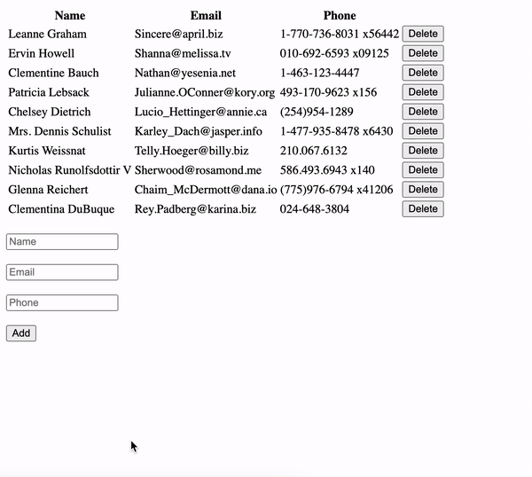

# React Code Interview

Please go through all the instructions carefully before beginning to write code.

## Some pointers

1) You will have 45 minutes to complete the code exercise. There are no marks/points system for this code exercise. Do not worry if you are unable to implement all the features, if you get stuck with any feature, move on to another one. Your code evaluation will have more weightage on how well you write your code and your understanding of React and Javascript concepts.

2) You are free to use google, stackoverflow, etc. to lookup for ideas/solutions if you get stuck anywhere.

3) You are free to use any 3rd party package/library for the implementation.

## Environment setup

Open below link in your browser (**Do not use incognito** mode as it does not seem to work). This will setup your React coding environment.

[https://stackblitz.com/fork/react](https://stackblitz.com/fork/react)

## Implementation

There are 3 features to be implemented. Feel free to switch between features if you get stuck anywhere.

#### 1) Render user table
Make an api call to [https://jsonplaceholder.typicode.com/users](https://jsonplaceholder.typicode.com/users) which will return a list of users. Display **Name**, **Email**, and **Phone** details of all users in a table. The columns should be configured in a manner where it is possible to add or remove columns without having to update the html code.

#### 2) Add a user
Create 3 text inputs respectively for **Name**, **Email**, and **Phone**, and an **Add** button. On clicking the Add button, it should insert a new row with the user details.

#### 3) Delete a user
Render a **Delete** button in every row. On clicking the Delete button, it should remove that user row from the table.

## Example

